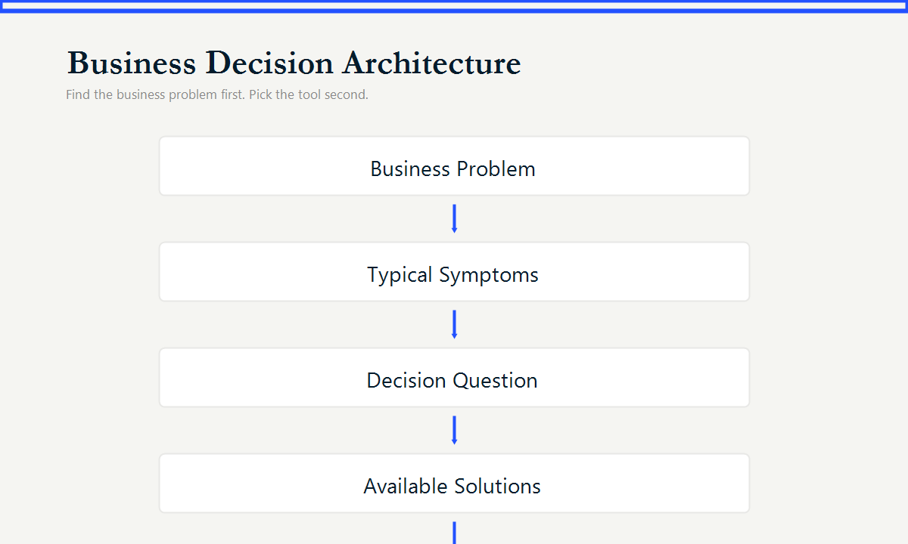
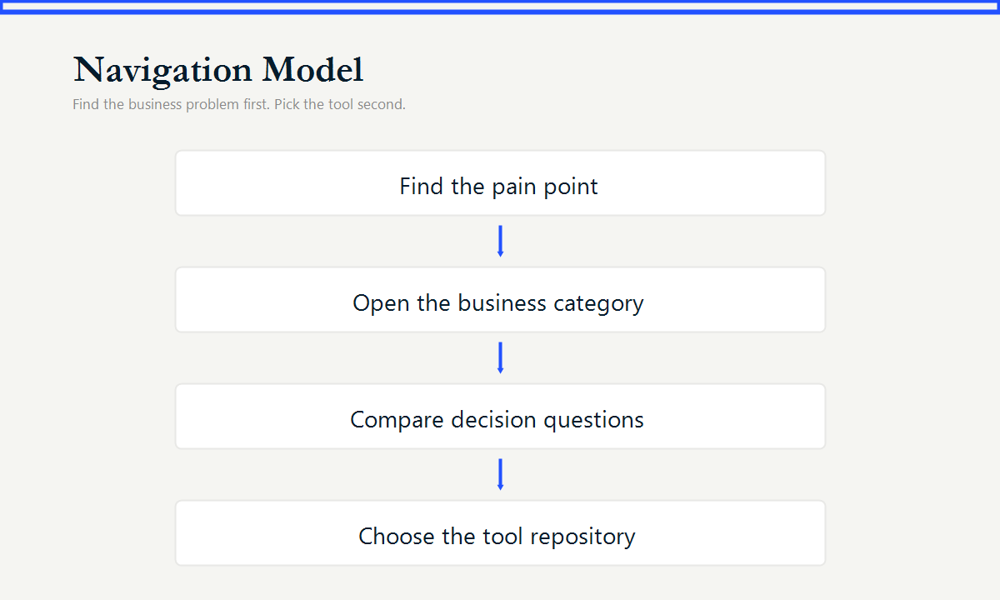

# BUSINESS DECISION TOOLBOX

A collection of lightweight business analysis systems
built with Excel & Google Sheets.

These tools do not replace ERP systems,
BI platforms, or enterprise software.

They productize proven business analysis methods,
allowing decision makers to transform operational data
into structured business decisions.

---

Find the business problem first.
Pick the tool second.

## Navigation Philosophy

```text
Business Problem
        |
Typical Symptoms
        |
Decision Support Tool
```



This repository is a navigation hub, not a portfolio and not a code showcase.
Start with the business pain, then move to the tool repository that supports the decision.

## Find Your Business Problem

| If you're asking... | Go here |
|---|---|
| Are we actually profitable? | [Profitability & Financial Decisions](catalog/profitability.md) |
| Why is cash always tight? | [Profitability & Financial Decisions](catalog/profitability.md) |
| Why is inventory increasing? | [Inventory & Supply Chain Decisions](catalog/inventory.md) |
| Why do we keep running out of stock? | [Inventory & Supply Chain Decisions](catalog/inventory.md) |
| Which marketing activities actually make money? | [Marketing & Growth Decisions](catalog/marketing.md) |
| Why are operations becoming inefficient? | [Operations & Resource Decisions](catalog/operations.md) |
| How do we stay compliant and reduce risk? | [Compliance & Risk Decisions](catalog/compliance.md) |
| How do we operationalize technical standards? | [Engineering & Technical Decisions](catalog/engineering.md) |
| How do we transform raw data into decisions? | [Data Architecture & Reporting Systems](catalog/data-architecture.md) |

## Directory Map

| Business Domain | Pain Statement | Catalog |
|---|---|---|
| Profitability & Financial Decisions | Revenue is growing, but profit and cash flow are not. | [Open catalog](catalog/profitability.md) |
| Inventory & Supply Chain Decisions | Inventory keeps growing while operational efficiency declines. | [Open catalog](catalog/inventory.md) |
| Marketing & Growth Decisions | Marketing spend increases, but nobody knows what actually generates profit. | [Open catalog](catalog/marketing.md) |
| Operations & Resource Decisions | Teams work harder every year but operational performance does not improve. | [Open catalog](catalog/operations.md) |
| Compliance & Risk Decisions | Regulatory complexity creates operational uncertainty and hidden costs. | [Open catalog](catalog/compliance.md) |
| Engineering & Technical Decisions | Engineering standards exist, but they are difficult to operationalize. | [Open catalog](catalog/engineering.md) |
| Data Architecture & Reporting Systems | Organizations have data everywhere but actionable decisions nowhere. | [Open catalog](catalog/data-architecture.md) |

## How This Directory Is Organized

Each category follows the same decision path:

```text
Business Problem
        |
Typical Symptoms
        |
Decision Question
        |
Available Solutions
        |
Repository
```

The directory avoids technology-first labels. A tool is listed because it answers a business question, not because it uses a specific spreadsheet feature.




## Repository Catalog

<!-- TOOL_CATALOG_START -->
_This section is generated from project README files. Do not edit it manually._

Total repositories scanned into catalog: **34**
Categories found: **0**

### Uncategorized

| Project | Business Scenario | Description | Tags | Repository |
|---|---|---|---|---|
| AIA Construction Estimating & Cost Tracking Workbook |  |  |  | [Repository](https://github.com/HyVoid/AIA-Construction-Estimating-Cost-Tracking-Workbook) |
| Audit Marketing ROI Against CRM Reality Instead of Platform Claims |  |  |  | [Repository](https://github.com/HyVoid/Marketing-Audit-Decision-Console) |
| Automate CRM-to-Reckon Invoice Imports with a Reusable Excel-Based Validation & IIF Generation Framework |  |  |  | [Repository](https://github.com/HyVoid/Reckon-IIF-Converter) |
| Build a Reliable Project Time Consolidation & Cost Analysis Control Center in Excel |  |  |  | [Repository](https://github.com/HyVoid/Project-Time-Cost-Analysis-Console) |
| Build a Zero-Maintenance Paid Media Reporting Semantic Layer in Excel & Google Sheets |  |  |  | [Repository](https://github.com/HyVoid/Paid-Media-Data-Hub) |
| Café Audit · 3D Diagnostics Engine |  |  |  | [Repository](https://github.com/HyVoid/restaurant-operation-audit) |
| Calculate Monthly VAT Across Shopify + Etsy with a Reusable Compliance Workbook |  |  |  | [Repository](https://github.com/HyVoid/VAT-Compliance-Portal) |
| Cin7 Business Performance Analyzer |  |  |  | [Repository](https://github.com/HyVoid/Cin7-Business-Performance-Analyzer) |
| Construction Tender Assembly Builder & Estimating Workbench |  |  |  | [Repository](https://github.com/HyVoid/Construction-Estimating-System) |
| Eliminate Pre-Order Distortion and Return Timing Bias in DTC Inventory Planning |  |  |  | [Repository](https://github.com/HyVoid/DTC-Brand-Inventory-Control-Deck) |
| Lawn Care Field Operations Console |  |  |  | [Repository](https://github.com/HyVoid/Lawn-Care-Field-Operations-Console) |
| Marketing Budget Allocation Simulator |  |  |  | [Repository](https://github.com/HyVoid/Marketing-Budget-Allocation-Simulator) |
| Measure the Real Revenue Impact of Marketing Channels Across CRM and Shopify Using a Lightweight Attribution Layer |  |  |  | [Repository](https://github.com/HyVoid/Marketing-Attribution-CRM-Analytics-Layer) |
| Multifamily Value-Add Acquisition Underwriting & Equity Return Model |  |  |  | [Repository](https://github.com/HyVoid/Multifamily-Value-Add-Acquisition-Model) |
| Operations & Financial Control Workbook for Multi-Party Service Businesses |  |  |  | [Repository](https://github.com/HyVoid/Excel-Operations-Control-Dashboard) |
| Optimize Inventory Decisions Before Stockouts or Overstock Happen |  |  |  | [Repository](https://github.com/HyVoid/Inventory-Replenishment-Planner) |
| Optimize Retail SKU Assortment Decisions with Dynamic Sales Contribution Analysis |  |  |  | [Repository](https://github.com/HyVoid/Retail-SKU-Concentration-Assortment-Diagnostic-Console) |
| Personal & Business Unified Budget Framework |  |  |  | [Repository](https://github.com/HyVoid/Personal-Business-Dual-Track-Budget-Manager) |
| Prevent Cash Shortfalls Before They Reach the Payment Date | Most cash shortfalls in growing businesses are not caused by unprofitable operations. They usually happen because customer pre-payments, milestone receipts, committed purchase orders, and staggered payment terms are difficult to consolidate manually — and standard accounting records are structurally blind to them until an invoice is raised. The risk is simp... |  |  | [Repository](https://github.com/HyVoid/rolling-cashflow-forecast) |
| Prevent Flight Duty Time Violations Before Dispatch | Most flight and duty time violations are not caused by bad intentions. They usually happen because rolling windows, mixed 702/705 activity, cumulative fatigue rules, reassigned duty, and fragmented records are difficult to monitor manually. The risk is simple: This workbook is designed to change the workflow: The commercial problem is not only regulation. I... |  |  | [Repository](https://github.com/HyVoid/Aviation-Compliance-Research-Repository) |
| RTL Loan Sizer & Pricer — Catch the Error Before It Reaches Closing |  |  |  | [Repository](https://github.com/HyVoid/RTL_Loan_Sizer_Pricer) |
| Run and deploy your AI Studio app |  |  |  | [Repository](https://github.com/HyVoid/Amazon-Business-Review-Engine) |
| Run Real Estate Deal Economics Before the Spreadsheet Opens | Most real estate deal analysis errors are not caused by bad financial judgment. They happen because amortization chains, VAT offset timing, scenario multiplier dependencies, and exit cash flow construction are difficult to isolate and verify inside a large Excel file. The risk follows a predictable path: Model opened in Excel Input changed Dependent formula... |  |  | [Repository](https://github.com/HyVoid/Real-Estate-Valuation-all-in-one-calculator) |
| Stop Explaining Inventory Loss. Start Locating It. |  |  |  | [Repository](https://github.com/HyVoid/MULTI-NODE-INVENTORY-RECONCILIATION) |
| TikTok Agency Monthly Performance Intelligence Operating System |  |  |  | [Repository](https://github.com/HyVoid/TikTok-Agency-Monthly-Performance-Intelligence-Engine) |
| Track Investment Pool Ownership Fairly When Capital Enters at Different Times | Most investment pool disputes are not caused by bad intentions. They happen because fixed percentages, mixed entry dates, and manual P&L allocation are difficult to reconcile when a participant withdraws — especially months or years after the positions that caused the disagreement were established. The risk is structural: This workbook changes the workflow:... |  |  | [Repository](https://github.com/HyVoid/Investment-Pool-management) |
| Track Real Profit, FX Exposure, Credit Risk, and Working Capital Across Europe–Africa Trade Operations |  |  |  | [Repository](https://github.com/HyVoid/Multi-Currency-Trade-Financial-Analyzer) |
| Transform Multi-Store Retail + Maquila Inventory Chaos into an Auditable SKU-Level Decision System |  |  |  | [Repository](https://github.com/HyVoid/Retail-and-Maquila-Inventory-Ledger) |
| Turn DIN 743 Shaft Calculations into Repeatable Engineering Decisions |  |  |  | [Repository](https://github.com/HyVoid/DIN-743-Shaft-Calculations) |
| Turn Event Registrations into a Person-Centric Membership Engagement Database |  |  |  | [Repository](https://github.com/HyVoid/Membership-Engagement-Analytics-Workspace) |
| Turn Fragmented Logistics Operations Into One Profit View |  |  |  | [Repository](https://github.com/HyVoid/cross-entity-logistics-console) |
| wedding-planner |  |  |  | [Repository](https://github.com/HyVoid/wedding-planner) |
| 🌍 DTC Inventory Planning Control Tower |  |  |  | [Repository](https://github.com/HyVoid/DTC-Inventory-Planning-Control-Tower) |
| 🚛 通用 3D 货柜装载优化模拟器 |  |  |  | [Repository](https://github.com/HyVoid/Universal-3D-Cargo-Loading-Optimization-Simulator) |
<!-- TOOL_CATALOG_END -->

## Catalog Automation

Project READMEs are the single source of truth for this directory. `catalog/tool-catalog.csv` and the generated catalog block above are rebuilt by `scripts/sync_catalog.py`; do not edit generated output manually.

For a repository to populate the catalog completely, its README should use these deterministic section headings: `Project Description`, `Business Category`, `Business Scenario`, `Core Features`, `Target Users`, and `Tags`. Missing sections are left blank instead of being inferred.


## Methodology Context

This toolbox answers: "Which decision system solves my business problem?"

For the underlying methodology, positioning, and trust context, visit:

[About Me](https://github.com/HyVoid/About-me)
